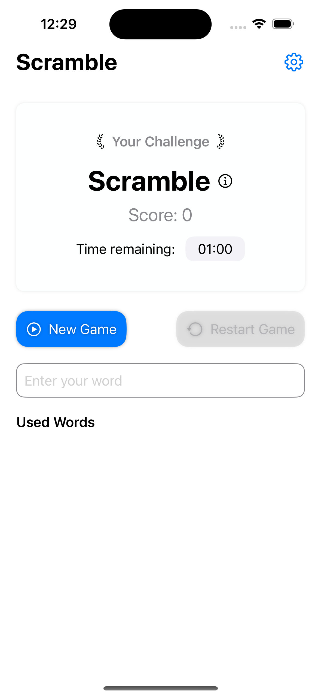
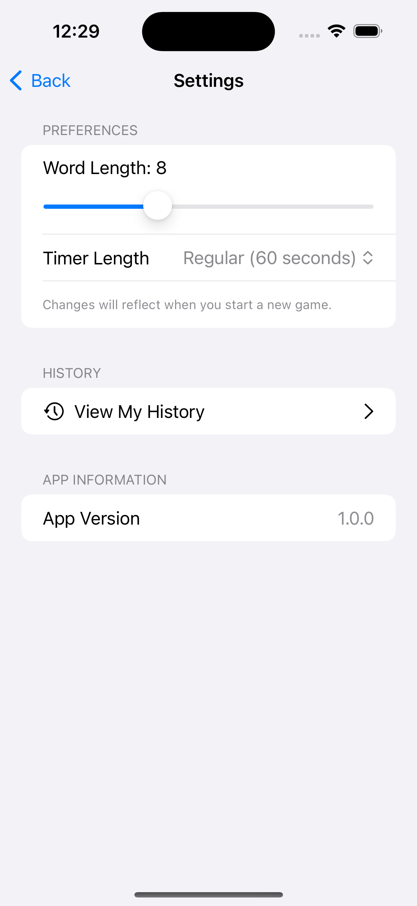
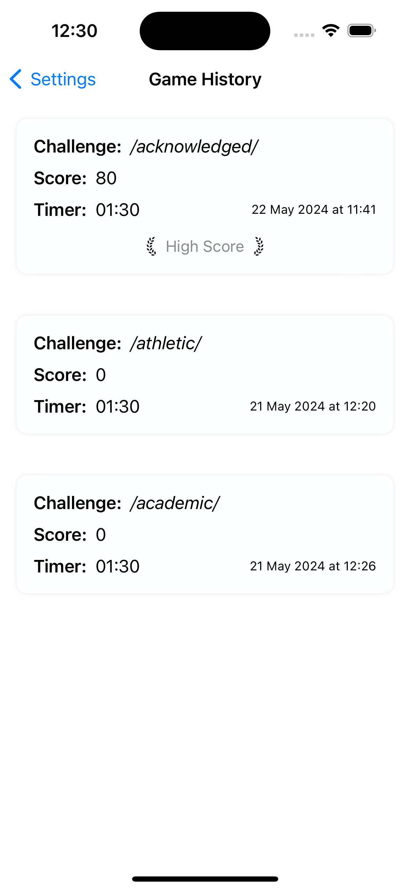
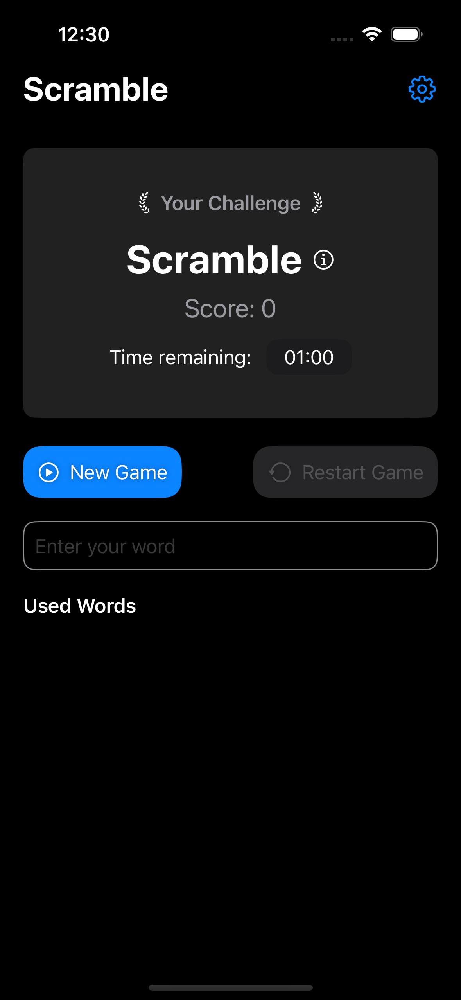
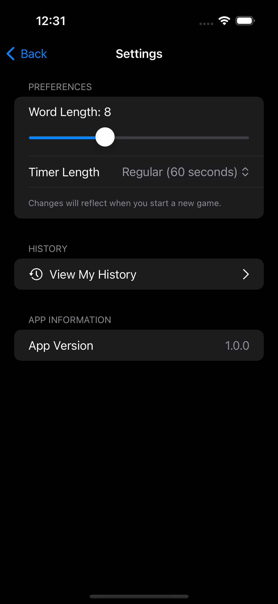
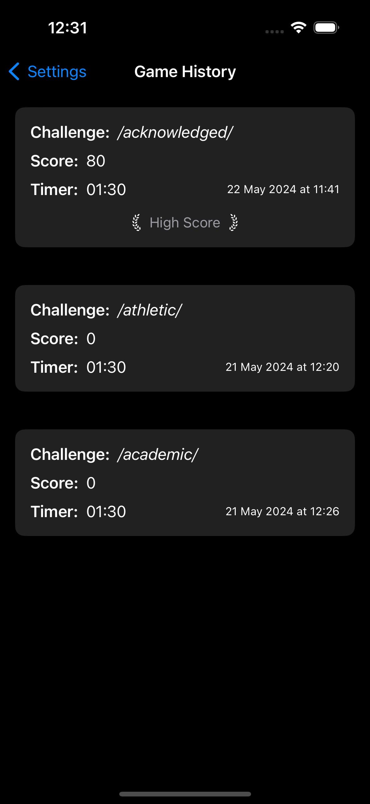

# Scramble

Scramble is an engaging word game designed to test your vocabulary and speed. 
In this game, players create as many valid words as possible from a given root word within a limited time frame.

### Motivation

The motivation behind Scramble was to create a fun and interactive game that has a bit more features than the project that inspired it.

### Problem it Solves

Scramble helps in improving vocabulary, spelling, and quick thinking. 
It provides a platform for players to challenge themselves and others, making learning fun and competitive.

### What I Learned

Building Scramble provided insights into:

- SwiftUI for creating interactive UIs.
- Integrating some UIKit features into SwiftUI like `UITextChecker`.
- Combine framework for creating and managing timers.
- Integration with local databases (an introduction into sqlite).
- Implementing game logic and handling edge cases.

### What Makes Scramble Stand Out

- **Interactive UI**: Smooth and responsive user interface designed with SwiftUI.
- **Real-time Feedback**: Immediate validation of words with visual feedback.
- **Educational Value**: Enhances vocabulary and cognitive skills through gameplay.
- **Customization Options**: Players can choose different word lengths and game durations.

## Features

- **Dynamic Word Generation**: Randomly generates root words of varying lengths.
- **Timer-Based Challenge**: Players race against the clock to form words.
- **High Scores**: Tracks and displays high scores to encourage competitive play.
- **Word Definitions**: Provides definitions for words to enhance learning.
- **Game History**: Stores game history for players to review past performances.

## Installation

To run Scramble locally, follow these steps:

1. **Clone the repository**:
   ```bash
   git clone https://github.com/devkilyungi/scramble.git
   ```

2. **Navigate to the project directory**:
   ```bash
   cd scramble
   ```

3. **Open the project in Xcode**:
   ```bash
   open Scramble.xcodeproj
   ```

4. **Run the project**:
   - Select your target device or simulator.
   - Press `Cmd + R` or click the Run button in Xcode.

## Credits

- Scramble was developed by V. Kilyungi.
- Inspired by the "WordScramble" project from the 100 Days of SwiftUI course by Paul Hudson.

### Demo Video & Screenshots

<table>
  <tr><td>Light Theme</td></tr>
  <tr>
    <td> </td>
    <td> </td>
    <td> </td>
  </tr> 
  <tr><td>Dark Theme</td></tr>
  <tr>
    <td> </td>
    <td> </td>
    <td> </td>
   </tr> 
</table>
